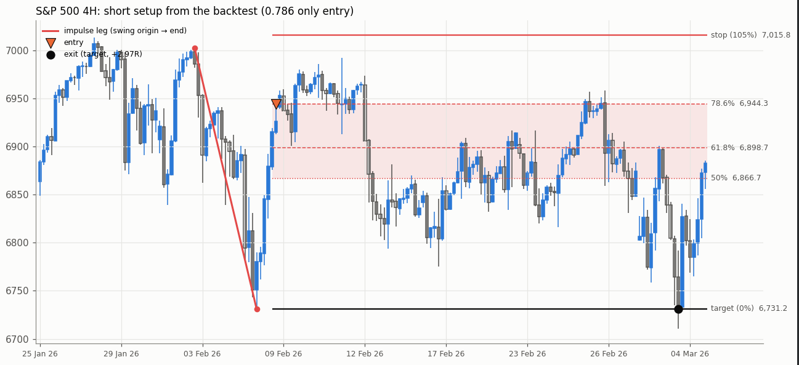
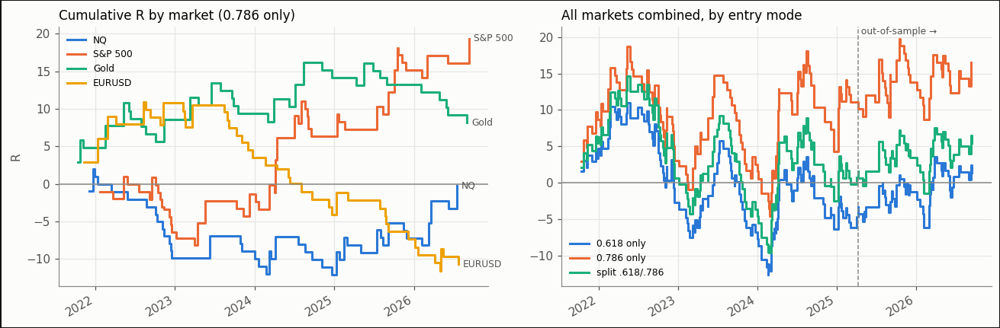
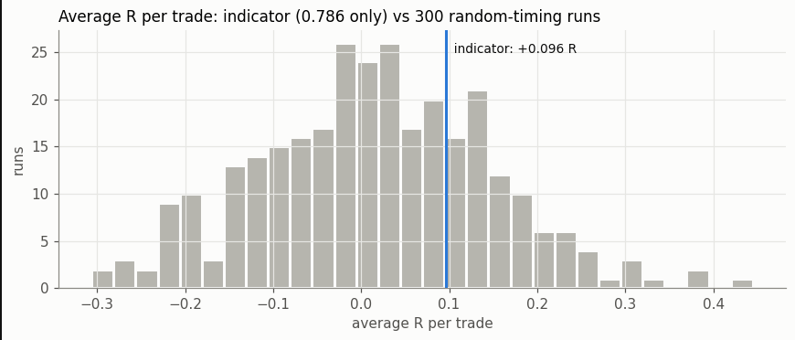

# Does an OTE retracement entry have an edge?

I built a TradingView indicator that finds **OTE (Optimal Trade Entry)** setups, a Fibonacci retracement zone popularised by the ICT trading community. Then I ported its logic to Python and tested whether trading it would actually have worked.

**Short answer:** the results are consistently slightly positive, but not statistically significant. I can't rule out luck, so I don't treat it as a proven edge.

---

## The question

After a sharp price move (an *impulse leg*), price often pulls back before continuing. The OTE idea is that the pullback into the **62%–79% retracement** of that move is a high-probability place to enter, in the direction of the original move.

The indicator (Pine Script, ~2,200 lines) detects the swing, filters out weak setups, and draws the zone, entry, stop and target:

| Rule | Setting |
|---|---|
| Swing detection | Pivots with an 18-bar lookback (4H), including the unconfirmed swing extreme |
| Filters | Break of structure, displacement ≥ 0.20 ATR/bar, swing age ≤ 72 bars, zone not already broken |
| Entry | Limit order at the 61.8% level, the 78.6% level, or split between the two |
| Stop | 105% (5% of the leg beyond the swing origin) |
| Target | 0%, the end of the impulse leg |

## How I tested it

- **Data:** 5 years of 4H bars (Sep 2021–Sep 2026) for **NQ, S&P 500, gold (XAUUSD) and EURUSD**, plus 20+ years of daily bars as a second check.
- **No look-ahead:** every decision uses only bars that had already closed. I verified this by recomputing signals on truncated histories; they match the full run exactly.
- **Realistic execution:** round-trip trading costs on every trade; gaps fill at the open, not at the level; if a bar touches both stop and target, the **stop is assumed to hit first**.
- **Avoiding cherry-picking:** I compared three entry levels, but **chose one using only the first 70% of the data**, then judged it on the last 30%, which played no part in the choice.
- **Random-timing baseline:** the same trades (same direction, stop and target distances) placed at random bars, 300 times. This separates the value of the *entry timing* from the value of the trade's shape.

Results are in **R**: profit or loss divided by the amount risked. −1R is a full stop-out.

## Results

### 4H, 5 years, all four markets combined

| Entry | Period | Trades | Win rate | Breakeven win rate | Avg R per trade | t-stat |
|---|---|---:|---:|---:|---:|---:|
| 0.618 | in-sample | 155 | 36.8% | 37.1% | −0.040 | −0.41 |
| 0.618 | out-of-sample | 59 | 44.1% | 37.5% | +0.128 | 0.80 |
| **0.786** | **in-sample** | **126** | **27.0%** | **24.0%** | **+0.088** | **0.55** |
| **0.786** | **out-of-sample** | **46** | **28.3%** | **24.8%** | **+0.118** | **0.44** |
| split | in-sample | 155 | 36.8% | 31.9% | −0.001 | −0.01 |
| split | out-of-sample | 59 | 44.1% | 32.8% | +0.095 | 0.57 |

The 0.786 entry had the best in-sample result, so it was selected. Out-of-sample it **stayed positive (+0.118R per trade)**, which is encouraging, but a t-stat of 0.44 is far from significant.

### Is the entry timing doing anything?

The indicator beat **72%** of random-timing runs. Evidence of real timing skill would need roughly 95%+. At 72%, the entry timing is **not distinguishable from chance**.

### Versus buy-and-hold (0.786 entry, risking 1% per trade)

| Market | Buy and hold | Strategy | Trades |
|---|---:|---:|---:|
| NQ | +101.3% | −0.9% | 44 |
| S&P 500 | +74.2% | +20.2% | 51 |
| Gold | +144.7% | +7.9% | 35 |
| EURUSD | −2.6% | −10.6% | 42 |

Holding the market did far better in three of four markets. The strategy sits in cash most of the time, so it also carries much less risk, but on raw returns it isn't close.

### Daily bars, 2000–2026 (a bigger sample)

| Entry | Period | Trades | Win rate | Breakeven win rate | Avg R per trade | t-stat |
|---|---|---:|---:|---:|---:|---:|
| 0.618 | in-sample | 84 | 36.9% | 37.5% | −0.055 | −0.43 |
| 0.618 | out-of-sample | 36 | 52.8% | 38.6% | +0.326 | 1.61 |
| **0.786** | **in-sample** | **67** | **25.4%** | **24.3%** | **+0.031** | **0.14** |
| **0.786** | **out-of-sample** | **28** | **42.9%** | **24.5%** | **+0.726** | **1.92** |
| split | in-sample | 84 | 36.9% | 32.1% | −0.025 | −0.18 |
| split | out-of-sample | 36 | 52.8% | 33.2% | +0.372 | 1.67 |

Applying the same rule, 0.786 is again selected, and out-of-sample it made **+0.73R per trade (t = 1.92)**, the strongest result in the study. I don't read it as proof:
- It rests on **28 trades**.
- The in-sample period (~18 years) was roughly **flat**, so the recent strength may reflect the market regime rather than the method.
- The daily out-of-sample period overlaps the 4H test period, so the two results are **not independent** confirmations.

## Conclusion

Across timeframes and entry levels the results lean positive, and the deeper 0.786 entry was selected in both tests and held up out-of-sample. But no result clears the bar for statistical significance, the entries don't beat random timing convincingly, and buy-and-hold was far better on raw returns. **Verdict: suggestive, not proven.** I wouldn't trade it with real money on this evidence.

## What I'd test next

- **More data:** 4H history back to 2010+ would roughly double the sample and cover more market regimes.
- **A true holdout:** freeze the rules now and forward-test on the next 12 months of data without changing anything.
- **Regime dependence:** does it only work in trending markets? Split results by volatility or trend state.
- **Walk-forward testing:** re-select the entry level on a rolling window rather than a single 70/30 split.

## Known simplifications

- 4H bars are built on UTC boundaries, so they won't line up exactly with TradingView's bars.
- Prices are Dukascopy bid quotes for the 4H test and Yahoo futures for the daily test; the spread is covered by the cost assumption.
- The indicator's support/resistance map and higher-timeframe filters aren't part of the test (the latter are off by default).

## Files

| File | What it is |
|---|---|
| `OTE_Backtest.ipynb` | The full backtest: indicator logic in Python, simulator, tests and charts. Runs in Colab with one click (button above). |
| `results/` | Trade lists and summary tables from the run above |
| `images/` | Charts used in this README |

The full TradingView indicator source (Pine Script, ~2,200 lines) is private and available on request.

---

© 2026 Michael Goliath. All rights reserved. Shared for portfolio review only; not licensed for reuse.
